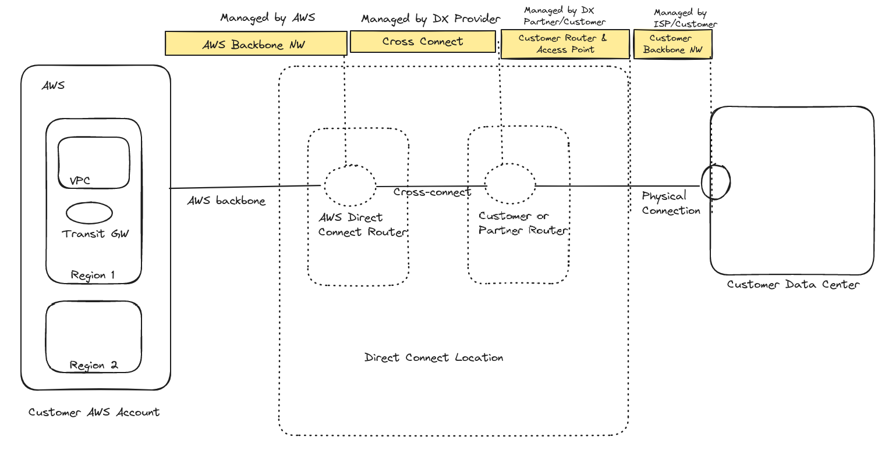

# WIP

### Why AWS Direct Connect?

Because customer can achieve highly resilient network connections between Amazon VPC and their on-premises infrastructure.

### Detailed Description of AWS Direct Connect Components

### Resources

1. https://aws.amazon.com/directconnect/

2. https://aws.amazon.com/directconnect/resiliency-recommendation/

3. https://aws.amazon.com/directconnect/locations/

4. [AWS Direct Connect - What is it and how it works - AWS Training Center](https://www.youtube.com/watch?v=V75f8Vs13Uo&list=RDCMUC1Yf7IBfhSNFTIyb7v83o_g&index=2)
